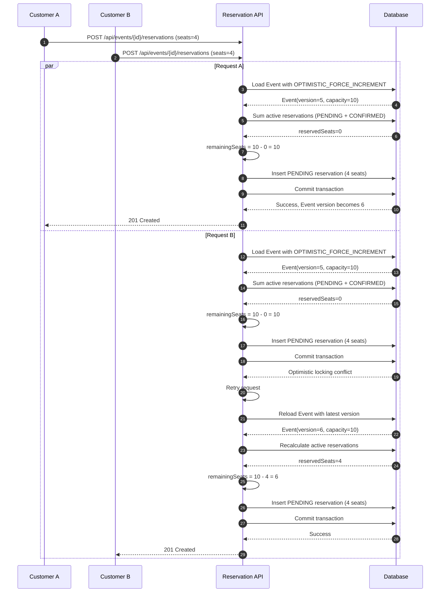
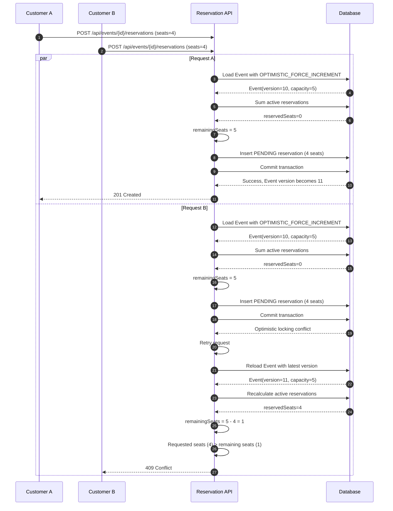

# Secure Ticketing & Reservation API

A Spring Boot backend API for publishing events and managing seat reservations.

The system provides secure authentication, event lifecycle management, reservation handling with oversell protection, idempotent operations, audit logging, and rate limiting.

The project was built as a backend assessment focusing on clean architecture, concurrency safety, and production-grade API practices.

---

# Overview

This API allows organizers to publish events and customers to reserve seats.  
The system ensures that seat capacity is never exceeded even under concurrent reservation attempts.

Key capabilities include:

- JWT authentication with refresh tokens
- Role-based authorization
- Event publishing workflow
- Reservation lifecycle management
- Idempotent reservation creation
- Optimistic locking with retry
- Audit logging
- Rate limiting
- OpenAPI documentation
- Integration and concurrency testing

---

# Tech Stack

- Java 21
- Spring Boot
- Spring Web
- Spring Security
- Spring Data JPA
- H2 Database (in-memory)
- OpenAPI / Swagger
- Spring Boot Actuator
- JUnit 5 / MockMvc / Mockito

---

# Features

## Authentication
- User registration
- Login with JWT access token
- Refresh token flow
- BCrypt password hashing

## Event Management
- Create draft event
- Update event
- Publish event
- List events by owner/admin
- Public event discovery with filtering

## Reservations
- Create PENDING reservation
- Confirm reservation
- Cancel reservation
- Capacity protection
- Idempotent reservation creation

## Security & Operations
- Role-based access control
- Audit logging
- Rate limiting
- OpenAPI documentation
- Actuator endpoints

---

# Architecture

The application follows a hexagonal architecture inspired structure.

Core business logic is kept independent from Spring and infrastructure concerns.  
The domain layer communicates with the outside world through **ports**, and infrastructure provides the corresponding **adapters**.

## Main Layers

### Domain / Application
Contains the core business logic:

- Domain models
- Commands and queries
- Command handlers
- Domain rules
- Ports (interfaces)

### Infrastructure
Contains implementation details:

- REST controllers
- Security configuration
- JWT implementation
- Persistence adapters
- JPA entities
- Audit logging
- Rate limiting
- OpenAPI configuration

The domain layer does **not depend on Spring or persistence frameworks**.

---

# Architectural Decisions

## 1. Hexagonal Style Architecture
Controllers do not pass HTTP request DTOs directly into domain logic.  
Instead, controllers create command/query objects and invoke handlers through abstractions.

This isolates business logic from web and persistence frameworks.

## 2. Separate Domain Models and Persistence Entities
Domain models are separate from JPA entities.

Persistence classes are suffixed with `Entity` to clearly distinguish them.

This prevents persistence concerns from leaking into business logic.

## 3. Capacity Check Happens at Reservation Creation
Capacity is validated when a reservation is created.

Pending reservations already consume seats because delaying the capacity check until confirmation would lead to poor user experience and inconsistent availability.

## 4. Oversell Prevention
The system prevents overselling by using:

- optimistic locking on events
- retries when conflicts occur

Concurrent reservation attempts compete on the same event version.  
If a conflict occurs, the request retries using the latest event state.

This ensures seat capacity is never exceeded.

## 5. Idempotency
Reservation creation requires an **Idempotency-Key**.

The key and request hash are stored in the database.

If the same request is retried:

- the API returns the same reservation result
- duplicate reservations are not created

If the same key is reused with a different request payload, the API returns a conflict.

## 6. Cross-Cutting Concerns
Infrastructure concerns such as:

- audit logging
- rate limiting

are implemented centrally rather than inside business handlers.

---

# Project Structure

```
src/main/java/com/ing/assessment

domain
 ├─ auth
 ├─ event
 ├─ reservation
 └─ audit

infra
 ├─ auth
 ├─ event
 ├─ reservation
 ├─ audit
 ├─ common
 └─ security
```

---

# Prerequisites

- Java 21+
- Maven 3.9+

---

# How to Run

Start the application:

```bash
mvn clean spring-boot:run
```

Application endpoints:

| Service | URL |
|-------|-----|
API | http://localhost:8080 |
Swagger UI | http://localhost:8080/swagger-ui/index.html |
H2 Console | http://localhost:8080/h2-console |
Health Check | http://localhost:8080/actuator/health |

---

# Seed Users

The application automatically creates demo users at startup.

| Role | Email | Password |
|-----|------|------|
ADMIN | admin@example.com | Admin123! |
ORGANIZER | organizer@example.com | Organizer123! |
CUSTOMER | customer@example.com | Customer123! |

---

# Authentication Flow

## Register

```
POST /api/auth/register
```

Payload:

```json
{
  "email": "user@example.com",
  "password": "Password123"
}
```

---

## Login

```
POST /api/auth/login
```

Response:

```json
{
  "accessToken": "...",
  "refreshToken": "...",
  "tokenType": "Bearer"
}
```

Use the access token in requests:

```
Authorization: Bearer <access-token>
```

---

## Refresh Token

```
POST /api/auth/refresh
```

Returns a new access token if the refresh token is valid.

---

# Sample JWT Claims

Access Token contains:

```
sub     -> user id
email   -> user email
roles   -> user roles
type    -> access
```

Refresh Token contains:

```
sub     -> user id
type    -> refresh
```

---

# API Documentation

Swagger UI:

```
http://localhost:8080/swagger-ui/index.html
```

OpenAPI JSON:

```
http://localhost:8080/v3/api-docs
```

---

# Key Business Rules

## Events

- Only **ADMIN** or event **owner** can update or publish events
- Draft events cannot be reserved
- Only published events are visible in public search

## Reservations

Reservation lifecycle:

         +---------+
         | PENDING |
         +---------+
              |
              | confirm
              v
         +-----------+
         | CONFIRMED |
         +-----------+
              |
              | cancel
              v
         +-----------+
         | CANCELLED |
         +-----------+

Rules:

- Only CUSTOMER or ADMIN can create reservations
- Reservations require an **Idempotency-Key**
- Confirming or cancelling updates reservation state
- PENDING reservations already consume seats.
- CONFIRMED reservations finalize the booking.
- CANCELLED reservations release capacity.

## Capacity

Active reservations consuming seats:

- PENDING
- CONFIRMED

Cancelled reservations free capacity.

---

# Concurrency & Idempotency

## Oversell Prevention

Concurrent reservation attempts are coordinated using optimistic locking on the event aggregate.

When multiple requests attempt to reserve seats simultaneously:

1. Both read the same event version
2. One transaction succeeds
3. The other detects a version conflict
4. The failed transaction retries using the updated state

This guarantees capacity is never exceeded.

## Retry Strategy

Optimistic locking conflicts trigger limited retries to avoid rejecting valid requests when capacity is still available.

## Idempotency

Reservation creation requires an `Idempotency-Key`.

If the same request is retried:

- the original reservation result is returned
- no duplicate reservations are created

If the same key is reused with different request payload:

- the API returns a conflict

---
## Reservation Concurrency Flow

The system prevents overselling by treating the **event** as the consistency boundary.

When two customers try to reserve seats for the same event at nearly the same time, both requests may initially read the same event version.  
The first transaction commits successfully and increments the event version.  
The second transaction detects an optimistic locking conflict, retries, and recalculates the remaining capacity using the latest state.



### Why this prevents overselling

1. The `Event` row is used as the concurrency control boundary.
2. Concurrent reservation attempts compete on the same event version.
3. Only one transaction can commit with the old version.
4. A conflicting request retries using the latest committed state.
5. Capacity is recalculated after retry, so the total reserved seats can never exceed event capacity.

## Reservation Concurrency Flow When Capacity Is Not Enough

The retry mechanism does not blindly retry forever.  
After an optimistic locking conflict, the request is re-evaluated using the latest state.  
If enough seats are no longer available, the API returns a conflict instead of overselling.



### Why the second request is rejected

1. The first request successfully reserves 4 seats.
2. The second request detects a version conflict and retries.
3. On retry, the system sees that only 1 seat remains.
4. Since 4 seats are requested, the API returns `409 Conflict`.
5. No overselling occurs.

## Why Optimistic Locking Was Chosen

The `Event` aggregate owns the seat capacity invariant.  
For that reason, reservation creation is coordinated through the event version rather than through a mutable `reservedSeats` field.

This approach keeps the domain model aligned with the case study entity definitions while still guaranteeing correctness under concurrent reservation attempts.

The implementation uses:

- `@Version` on `Event`
- `OPTIMISTIC_FORCE_INCREMENT` during reservation creation
- limited retries after optimistic locking conflicts
- recalculation of active reserved seats (`PENDING + CONFIRMED`) on each retry

# Rate Limiting

Rate limiting protects sensitive endpoints against abuse.

Example limits:

| Endpoint | Limit |
|--------|------|
Login | 5 requests / minute |
Register | 3 requests / minute |
Refresh | 10 requests / minute |

Implementation uses an **in-memory rate limiting filter** for simplicity.

In production environments, this would typically be implemented using Redis or an API gateway.

---

# Audit Logging

Mutating operations generate audit records containing:

- actorId
- action
- resourceType
- resourceId
- IP address
- user agent
- timestamp

Audit logging is implemented using **AOP** to avoid polluting business logic.

---

# Actuator Endpoints

Operational endpoints are enabled through Spring Boot Actuator.

Available endpoints:

```
GET /actuator/health
GET /actuator/info
```

---

# Testing

Run all tests:

```bash
mvn test
```

Tests include:

- unit tests for command handlers
- integration tests using H2
- security tests
- optimistic locking tests
- concurrency tests using multiple threads
- idempotency tests

---

## System Flow

The high-level flow of the system is shown below.

          +------------------+
          |      Client      |
          +------------------+
                   |
                   | HTTP REST API
                   v
          +------------------+
          |   REST Controller |
          +------------------+
                   |
                   | Command / Query
                   v
          +------------------+
          |  Command Handler |
          |  (Application)   |
          +------------------+
                   |
                   | Ports
                   v
          +------------------+
          | Infrastructure   |
          |  (Adapters)      |
          | - JPA            |
          | - Security       |
          | - Audit          |
          | - Rate Limit     |
          +------------------+
                   |
                   v
             +-----------+
             | Database  |
             +-----------+

Controllers translate HTTP requests into commands or queries.
Handlers execute business logic and interact with infrastructure through ports.


# Future Improvements

Potential improvements for a production system:

- Redis-backed distributed rate limiting
- Distributed idempotency storage
- Event streaming for audit logs
- Outbox pattern for integration events
- Pagination for event queries
- Observability with metrics and tracing
